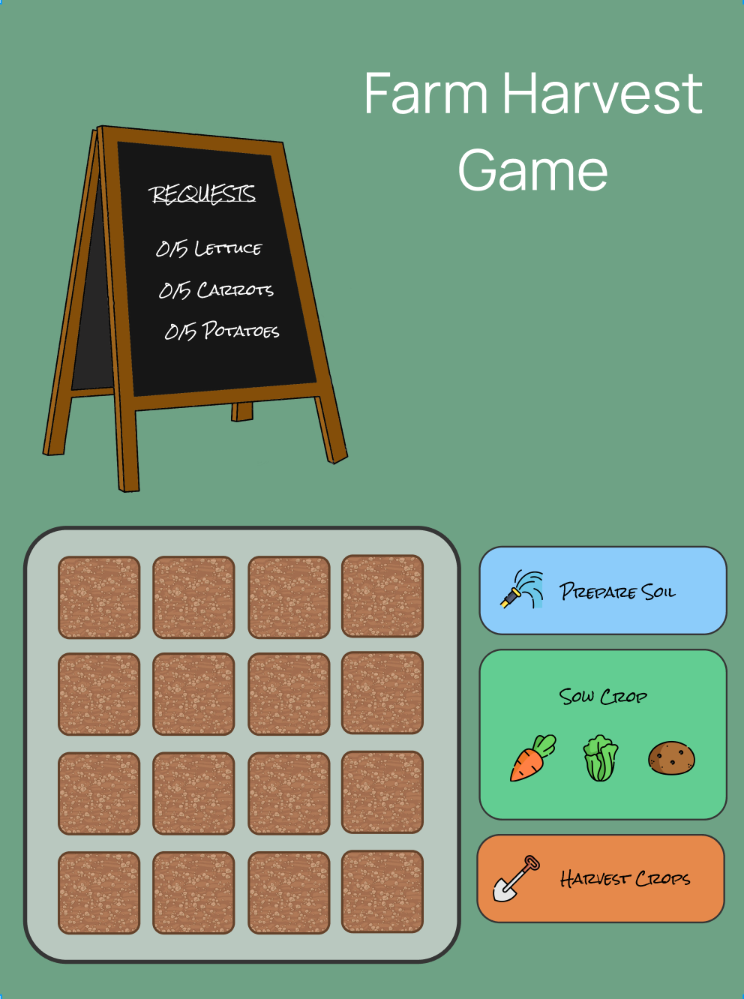
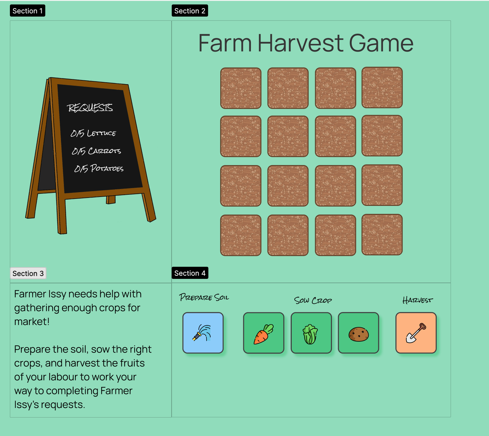

# Farm Game
***
## Table of Contents
1. [Planning](#Planning)
2. [Building](#Building)
3. [Debugging](#Debugging)

### Planning
***
I started out by considering what kind of game related to my interests, and came upon the idea of making something related to gardening or farming as I used to work on a farm, and also love gardening! My first outline for the idea was a farm which the user would be able to interact with by watering the soil, sowing seeds, and harvesting crops. I thought about how this could be made into something that could be completed and came up with the idea of a random number generator that would display numbers of crops that needed to be harvested in order the complete the game.

I began by designing this basic idea on Figma, as shown:

And then ended on this version which I would start building from:

### Building
***
1. Translate my final Figma design into CSS and HTML, using a grid layout for each different section:
    - Request Section
    - Field Section
    - Instructions Section
    - Controls Section 
2. Create 16x JS generated soil patches in combination with grid layout.
3. Create a JS random number generator for calculating crop requests, positioned on top of the chalkboard image.
4. Make the user tool buttons toggle on/off upon click.
5. Make each individual soil patch selectable.
6. Create a watering function. 
    - Must require watering tool to be selected.
    - Changes the clicked soil patch's class to 'watered'.
7. Create a seed sowing function for each crop.
    - Must require the patch to be watered, and for a crop to be selected.
8. Add a timer to the seed sowing function which will automatically change the soil patch's class from 'seed_sown' to 'seed_ready' after a set duration.
9. Create a harvesting function.
    - Requires the watering tool to be selected.
    - Requires the patch to be 'seed_ready'. 
    - Upon harvesting the seed, a variable counts how many of each crop has been harvested.
    - Upon harvesting, the soil patch returns back to it's original 'baresoil' state, so that it is reusable.
10. Make the crop counting variable stop counting when it reaches the target amount.

Extra ideas:
Make it so that when you complete a round, you unlock something new, like a sunshine, a house or something, or maybe you earn coins or XP.

### Debugging
***

#### Issue: Random number generator creates one random number rather than multiple.
Original code: 
let randomNumber = Math.floor(Math.random() * 5) + 1;

Solution:
My idea had been to display randomNumber three times to show three different crop requests. I realised I'd forgotten that randomNumber would just display the same number each time. To get around this without creating three different random number variables for each crop, I created an empty set and then a loop which would run until three items had been added to the set:

const randomNumber = new Set();

while ( randomNumber.size !== 3 ) {
      randomNumber.add(Math.floor(Math.random() * 5) + 1);
      }

I then turned this set into an array, which meant I could then call the particular random number from it's index position:

cropTarget = Array.from(randomNumber);
      requestBoard =
        `
        <h2>Requests</h2>
        
Lettuce: ${lettucePlayer}/${cropTarget[0]}

        
Carrots: ${carrotPlayer}/${cropTarget[1]}

        
Potatoes: ${potatoPlayer}/${cropTarget[2]}

        `
      document.querySelector('.request_section').insertAdjacentHTML('beforeend', requestBoard); 

#### Issue: Selecting an individual patch in different states using new functions each time.
Orginal code: 
Select bare soil:

const bareSoil = Array.from(document.querySelectorAll('.barepatch'));

for (let i = 0; i < bareSoil.length; i++) {
    bareSoil[i].addEventListener("click", function checkSoilClick(event) {
        if (waterClicked) {
            event.target.outerHTML = `

`;
            ... }
            
    wateredSoil = Array.from(document.querySelectorAll('.watered'));
        for (let j = 0; j < wateredSoil.length; j++) {
            wateredSoil[j].addEventListener("click", function checkWaterClick(event) {
                if (carrotClicked) {
                    event.target.setAttribute("class", "carrot_sown");
                    ... }
                }
            )
        }
    })
}

Solution: 
Rather than creating an unecessary array in combo with querySelectorAll I changed it to just a querySelectorAll:

let soilPatches = document.querySelectorAll('.barepatch');

And then added a single for loop which could be used again and again. The italicised code is purely so I could tell which patch was being interacted with. By then adding one addEventListener which would listen for multiple functions (written elsewhere) rather than nesting addEventListeners and functions within each other, my code instantly became much more organised: 

for (let i = 0; i < soilPatches.length; i++) {
  const patch = soilPatches[i];
  *patch.dataset.id = i + 1; // numbers the patches so you can tell which is working*

  patch.addEventListener('click', () => {
    waterPatch(patch);
    plantCarrot(patch);
    plantLettuce(patch);
    plantPotato(patch);
    harvestPatch(patch);
  });
}

#### Issue: User able to plant seed without soilpatch being watered.
Original code:
   if (waterClicked) {
            event.target.outerHTML = `

`;
            soilWatered = true;
        } else {
            console.log('Nope, water not selected.');      
        }

##### Solution: 
In my original code when I watered a patch, a variable called soilWatered would switch from false to true.
However, this meant that even if I watered a random patch, if I had clicked the toggled the water button even once, the user would be able to sow crops anywhere.

To fix this I removed the soilWatered variable altogether and instead focused on the changed class state. When going to plant a crop I added the classList.contains condition which would check whether that specific patch had been watered.

function waterPatch(patch) {
  if (isWatering) {
    **patch.classList.add('watered');**
    **patch.classList.remove('barepatch');**
    console.log(`Watered patch ${patch.dataset.id}`);
  } else {
    console.log('Watering is not on');
  }
}

function plantCarrot(patch) {
  if (isPlantingCarrots && **patch.classList.contains('watered')**) {
    ... }
    }

#### Issue: 
1. Code working when entered into the console, but not in Visual Code. 
2. wateredSoil array showing up as empty.
3. Functions needing to be nested inside of each other - messy and error prone!

Original Code: 
for (let i = 0; i < bareSoil.length; i++) {
    // this query selector loops through all the soil patches and adds a listener to each tile
    bareSoil[i].addEventListener("click", function detectClick(event) {
      if (waterClicked) {
        // using target means only the clicked on tile will be affected 
        // event.target.setAttribute("class", "watered");
        event.target.outerHTML = `

`;
        soilWatered = true;
      } else {
        console.log('Nope, water not selected.');      
        }
    *wateredSoil = Array.from(document.querySelectorAll('.watered'));*
    })
};

// Selecting WATERED soil patch
**wateredSoil = Array.from(document.querySelectorAll('.watered'));**
let carrotSown = false;
console.log(wateredSoil);

for (let i = 0; i < wateredSoil.length; i++) {
    wateredSoil[i].addEventListener("click", function checkClick(event) {
      if (carrotClicked) {
        event.target.setAttribute("class", "carrot_sown");
        carrotSown = true;
        console.log('Carrot planted!');
      } else {
        console.log('Nope, carrot not planted.');      
        }
    })
};

##### Solution:
This took a good while to realise that I needed to completely restructure and simplify my code rather than have functions nested within each other. I first clocked the issue when trying to access the waterSoil array and it showing up as empty. I couldn't spot any syntax errors and then finally realised that because the code was called upon loading, the array wasn't updating when adding new values. I moved the array from it's position shown in bold to the italicised spot which fixed the problem of it showing up as empty.

However, this opened a whole new can of worms. Whilst my array was fixed I realised that for my code to work in it's current format I would have to create a long nested function with lots of conditions:

for (let i = 0; i < bareSoil.length; i++) {
    bareSoil[i].addEventListener("click", function checkSoilClick(event) {
        if (waterClicked) {
            event.target.outerHTML = `

`;
            soilWatered = true;
        } else {
            console.log('Nope, water not selected.');      
        }

        wateredSoil = Array.from(document.querySelectorAll('.watered'));

        for (let j = 0; j < wateredSoil.length; j++) {
            wateredSoil[j].addEventListener("click", function checkWaterClick(event) {
                if (carrotClicked) {
                    event.target.setAttribute("class", "carrot_sown");
                    carrotSown = true;
                    console.log('Carrot planted!');
                    wait(3000);
            event.target.setAttribute("class", "carrot_ready");
            carrotReady = true;
            console.log('Carrot ready!');
                } else {
                    console.log('Nope, carrot not planted.');      
                }
            })
        };
    })
};

 I took a step back and realised I needed to massively refine my code, reorganise, and seperate out all the event listeners, functions, and variables. This led me to my current code which was much cleaner.

#### Issue: Player crop count keeps counting even when met target.

Original Code:
function harvestPatch(patch) {
    if (isHarvesting && patch.classList.contains('carrot_ready')) {
        carrotPlayer += 1;
        console.log(`You've harvested ${carrotPlayer}/${cropTarget[1]} carrots!`);
        patch.classList.add('barepatch');
        patch.classList.remove('carrot_ready');
        carrotPlayerCount.innerHTML = `Carrots: ${carrotPlayer}/${cropTarget[1]}`;

    } else if ... 
}

Solution:
Remove the carrotPlayer variable and .innerHTML from the harvestPatch function and create a new function which only runs if the player hasn't met the crop target, then call this function in the harvestPatch function:

function countCarrots() {
   
  if(carrotPlayer < cropTarget[1]) {
    carrotPlayer++;
    carrotPlayerCount.innerHTML = `Carrots: ${carrotPlayer}/${cropTarget[1]}`;
  }
}

function harvestPatch(patch) {
    if (isHarvesting && patch.classList.contains('carrot_ready')) {
        countCarrots();
        console.log(`You've harvested ${carrotPlayer}/${cropTarget[1]} carrots!`);
        patch.classList.add('barepatch');
        patch.classList.remove('carrot_ready');

    } else ...
}

#### Issue: Tool button remains selected even when clicking on another tool button. 

Original code:

    
<button class="tool_button" id="prepare_soil"></button>

    
<button class="tool_button" id="sow_carrot"></button>

    
<button class="tool_button" id="sow_lettuce"></button>

    
<button class="tool_button" id="sow_potato"></button>

    
<button class="tool_button" id="harvest"></button>

I changed this so that each button was a radio instead, meaning only one could be selected at a time. However, this removed my button styling and replaced it with a default radio button, so I added labels with corresponding css that would make them display like my original button, and used display: none to hide the default radio button.

    

    <input class="tool_button" id="prepare_soil" type="radio" name="tool" value="prepare_soil">
    <label for="prepare_soil" class="tool_label tool_prepare_soil"></label>
    

    

    <input class="tool_button" id="sow_carrot" type="radio" name="tool" value="sow_carrot">
    <label for="sow_carrot" class="tool_label tool_sow_carrot"></label>
    

    

    <input class="tool_button" id="sow_lettuce" type="radio" name="tool" value="sow_lettuce">
    <label for="sow_lettuce" class="tool_label tool_sow_lettuce"></label>
    

    

    <input class="tool_button" id="sow_potato" type="radio" name="tool" value="sow_potato">
    <label for="sow_potato" class="tool_label tool_sow_potato"></label>
    

    

    <input class="tool_button" id="harvest" type="radio" name="tool" value="harvest">
    <label for="harvest" class="tool_label tool_harvest"></label>
    

.tool_button {
  display: none;
}

.tool_label {
  padding: 30px;
  display: block;
  border: 2px solid #3F3F3F;
  border-radius: 15%;
}

.tool_prepare_soil {
  background: #8DCCFC url("../images/hose.png") no-repeat center;
  background-size: 80%;
}

I then needed to update my JS so that my waterButton variable pointed to the label rather than the old button ID:

let waterButton = document.getElementById('prepare_soil');
let waterButton = document.querySelector('.tool_prepare_soil');

I then realised that by setting .tool_button display to none, I also lost the benefits of using the radio input in the first place, so stopped to rethink.

I decided to go back to my original HTML, and change the buttons active status via JS:

function toggleHarvesting() {
    isHarvesting = !isHarvesting;
    toggleButtons(harvestButton);
    console.log(`Harvesting is ${isHarvesting ? 'on' : 'off'}`);
}

// 
function toggleButtons(activeButton) {
    // activeButton passes the button just clicked as the argument
    // Loop through all buttons and turn them off if not the clicked button.
    for (let button of [waterButton, carrotButton, lettuceButton, potatoButton, harvestButton]) {
      if (button !== activeButton) {
        button.style.opacity = 1;
        // Set the corresponding boolean variable to false
        if (button === waterButton) isWatering = false;
        if (button === carrotButton) isPlantingCarrots = false;
        if (button === lettuceButton) isPlantingLettuce = false;
        if (button === potatoButton) isPlantingPotato = false;
        if (button === harvestButton) isHarvesting = false;
      }
    }
    // Turn on the active button
    activeButton.style.opacity = 0.7;
  }

This code turns off all other buttons when one is clicked. I'll explain using the harvest button.
The toggleHarvesting function has an event handler which listens for a click and then toggles the true/false value of the variable isHarvesting.
The toggleHarvesting function then calls the toggleButtons function using the harvestButton as the argument. The toggleButtons function loops through all the buttons 
and turns off all other buttons where harvestButton === harvestButton. This leaves the isHarvesting value as true, meaning it can be used, and changes the button appearance so that the user knows it's active. 

#### Issue: Field grid column collapses if all tiles in row are selected.
Solution: I forgot to apply the height/width styling to the changed classes as well as barepatch.
Before:
 .barepatch {
    background-image: url("../images/soil.jpg");
    background-size: contain; 
    height: 80px;
    width: 80px;
    }
After:
.barepatch, .watered, .carrot_sown, .carrot_ready, .lettuce_ready, .lettuce_sown, .potato_sown, .potato_ready {
      border: 2px #3F3F3F solid;
      border-radius: 15%;
      filter: brightness(1.5);
      height: 80px;
      width: 80px;
    }